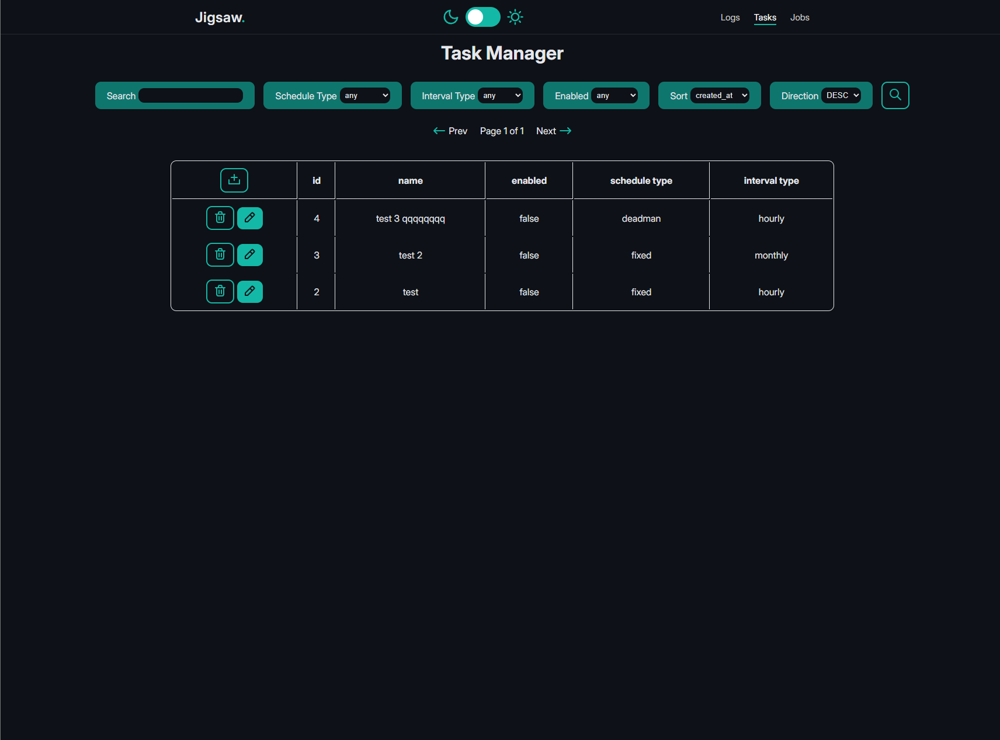
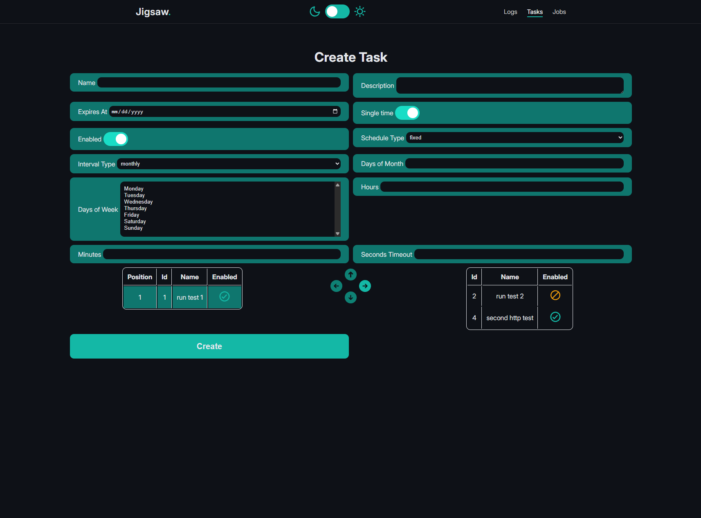
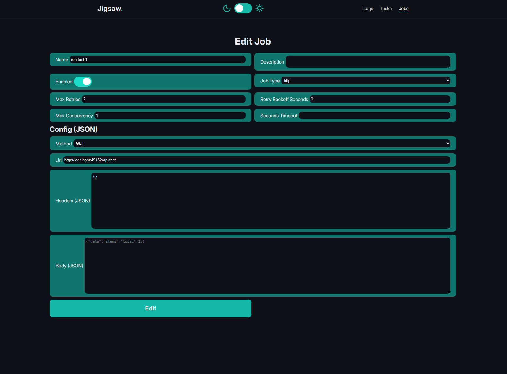
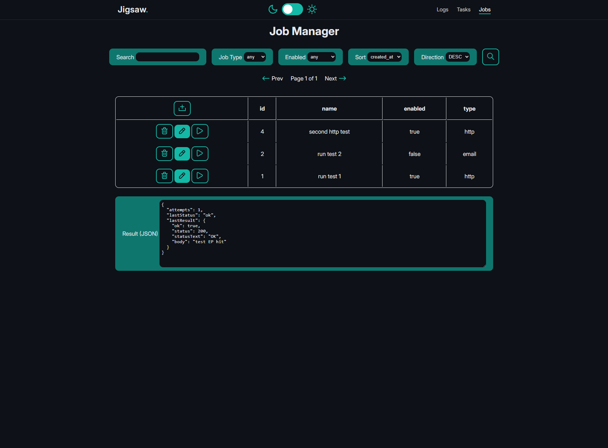
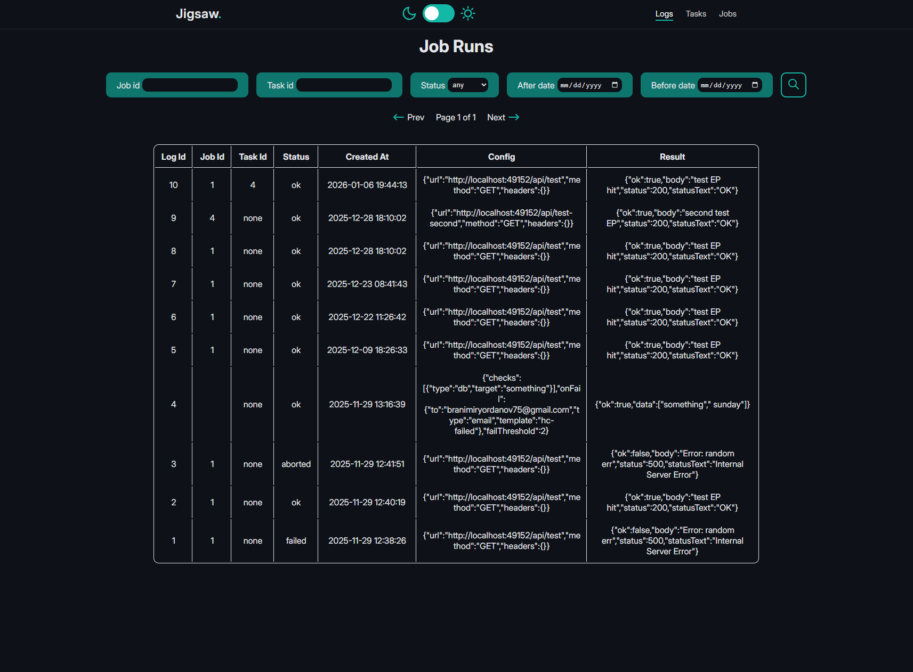

# Jigsaw

A self-hosted job scheduler and task automation tool with a web UI. Define reusable **Jobs** (HTTP calls, shell commands, emails, healthchecks), compose them into **Tasks** with flexible schedules, and track every execution in a **run log**.

## Features

- **Multiple job types** — HTTP requests, shell commands, email dispatch, healthcheck pings
- **Flexible scheduling** — hourly, daily, weekly, or monthly with fine-grained day/hour/minute selection
- **Deadman switch tasks** — sends a ping email on schedule; if not acknowledged within the timeout window, the task's jobs fire (useful for monitoring that a recurring process is still alive)
- **Retry & backoff** — configurable max retries with exponential-style backoff per job
- **Concurrency control** — cap parallel executions per job
- **Per-job timeouts** — abort hung jobs automatically
- **Run history** — every execution attempt is logged with status, result, and error details
- **Web UI** — manage tasks, jobs, and run logs through a built-in EJS frontend (light/dark theme)
- **REST API** — all operations are also available programmatically under `/api`

## Concepts

| Entity      | Description                                                                                                                                 |
| ----------- | ------------------------------------------------------------------------------------------------------------------------------------------- |
| **Job**     | A reusable unit of work with a type (`http`, `shell`, `email`, `healthcheck`) and its own config, retry, concurrency, and timeout settings. |
| **Task**    | A scheduled trigger that runs one or more Jobs in sequence. Supports `fixed` (cron-like) and `deadman` schedule types.                      |
| **Job Run** | An immutable log entry recording the outcome of a single job execution attempt (status, result, error, config snapshot).                    |

## Tech Stack

- **Runtime** — Node.js + TypeScript
- **Web framework** — Express 5
- **Templating** — EJS + express-ejs-layouts
- **Database** — PostgreSQL 16
- **Validation** — Zod
- **Email** — Nodemailer (configured for Elasticmail)
- **Tests** — Vitest
- **Local infra** — Docker Compose

## Getting Started

### Prerequisites

- Node.js 20+
- Docker & Docker Compose

### Installation

```bash
npm install
```

### Environment variables

Create a `.env` file in the project root. Required variables:

```env
# Database
DB_HOST=localhost
DB_PORT=5432
DB_NAME=db
DB_USER=root
DB_PASSWORD=0000

# App
PORT=3000
APP_BASE_URL=http://localhost:3000

# Email (Nodemailer / Elasticmail SMTP)
SMTP_HOST=smtp.something.com
SMTP_PORT=2222
SMTP_USER=user
SMTP_PASS=0000
```

### Start (development)

```bash
npm run start
```

This will:

1. Start the PostgreSQL container via Docker Compose
2. Run all pending database migrations
3. Start the dev server with hot-reload (nodemon)

| Service         | URL                   |
| --------------- | --------------------- |
| App             | http://localhost:3000 |
| Adminer (DB UI) | http://localhost:8080 |

## Scripts

| Script                     | Description                        |
| -------------------------- | ---------------------------------- |
| `npm run start`            | Start DB + migrate + dev server    |
| `npm run dev`              | Dev server only (nodemon)          |
| `npm run migrate`          | Run pending migrations             |
| `npm run migrate:revert`   | Revert last migration              |
| `npm run migrate:status`   | Show migration status              |
| `npm run migrate:generate` | Generate a new migration file      |
| `npm run start:db`         | Start only the Docker DB container |
| `npm test`                 | Run tests in watch mode            |
| `npm run test:run`         | Run all tests once                 |
| `npm run test:cov`         | Run tests with coverage report     |
| `npm run test:itest`       | Run integration tests only         |

## Database Migrations

Migrations live in [src/migrations/](src/migrations/) as plain `.sql` files, named with a numeric prefix and `.up.sql` / `.down.sql` suffixes.

```
0_update-function
1_create-task-table
2_create-job-table
3_create-tasks-jobs-relation
4_create-job-runs-table
5_add-update-job-table
6_add-dead-man-token-to-tasks
```

## Project Structure

```
src/
├── api/              # REST API routers
├── db/               # DB pool and base repository
├── migrations/       # SQL migration files
├── modules/
│   ├── tasks/        # Task entity, service, repository
│   ├── jobs/         # Job entity, service, repository, DTOs per job type
│   ├── job-runs/     # Run log entity, service, repository
│   ├── taks-jobs/    # Task ↔ Job many-to-many relationship
│   ├── execution/    # Scheduler, runner, retry logic, concurrency gate
│   └── email/        # Email templates
├── views/            # EJS templates and page controllers
├── helpers/          # Shared utilities
├── scripts/          # Migration runner script
├── tests/            # Integration tests
├── app.ts            # Express app factory
└── server.ts         # Entry point
```

## Job Types

### HTTP

Makes an HTTP request to a configured URL. Useful for triggering webhooks or calling external APIs.

### Shell

Executes a shell command on the host. Use with care.

### Email

Sends an email via Nodemailer (SMTP). Used internally for deadman switch notifications and can be used as a standalone job.

### Healthcheck

Pings a URL and expects a successful response. Useful for keeping services alive or monitoring endpoints.

## Deadman Switch

A **deadman** task flips the normal trigger logic: instead of running jobs when the schedule fires, it sends a ping email. The recipient has a configurable window to acknowledge by visiting a cancel URL in the email. If the window expires without acknowledgement, the task's jobs execute — signalling that the expected periodic process did not run.

This pattern is useful for monitoring that an external job (e.g. a nightly backup, a cron on another server) actually happened.

## Testing

Unit and integration tests use [Vitest](https://vitest.dev/).

Integration tests require a test database. Start it first:

```bash
npm run start:test-db
npm run test:itest
```

## Screenshots






